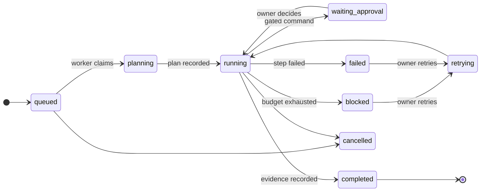

<p align="center">
  <picture>
    <source media="(prefers-color-scheme: dark)" srcset="brand/saaya-hero-dark.svg">
    
  </picture>
</p>

<p align="center"><strong>Saaya</strong> (saa-yaa, Urdu for shadow), a persistent AI coworker built on LangChain's Deep Agents and LangGraph.</p>

<p align="center">
  <a href="docs/DEMO.md">Five-minute demo</a> &middot;
  <a href="docs/ARCHITECTURE.md">Architecture</a> &middot;
  <a href="docs/DEPLOYMENT.md">Deploy</a> &middot;
  <a href="AGENTS.md">Working in this repo</a>
</p>

<p align="center">
  <a href=".github/workflows/ci.yml"></a>
  
  
  
</p>

- **Durable jobs**: plans, contained workspaces, an append-only ledger, and
  approval gates that survive killing the server
- **Memory with provenance**: taught, corrected, forgotten, never silently
  erased
- **One coworker, three doors**: the same threads from web, Slack, and MCP
- **Self-extension with consent**: proposed tools stay inert until you read
  and approve the script

Most AI assistants are disposable. You open a chat, get an answer, close the
tab, and everything is gone: the context, the work in progress, the things
you already explained. Saaya is built around the opposite assumption. It
keeps its own workspace, remembers with provenance, runs real multi-step
work that survives being killed mid-task, and asks before doing anything
consequential.

The distinction that matters: Saaya is not a chat endpoint wrapped around a
model. A request can become a durable Job with a visible plan, a contained
workspace, an append-only event ledger, approval gates that genuinely
withhold execution, registered artifacts, and checkpointed recovery. Chat is
the control surface. The work is the product.

## The idea

Conversations with most assistants evaporate. Work is trapped inside a
single response. A long task dies with the process that ran it. Tool calls
happen out of sight. Memory, where it exists, cannot say where it came from
or be safely undone. And you can never quite tell what is running, what is
stuck, and what is waiting on you.

Saaya's alternative is a coworker with durable state. Every conversation is
checkpointed and resumable. Substantial requests become Jobs whose whole
history is an append-only ledger the interface renders verbatim. Execution
pauses for your approval before consequential commands, and the runner
re-checks the recorded decision at execution time, so no client can skip
it. Memory carries provenance and every self-directed change is validated
deterministically, versioned, and reversible. If the process dies mid-step,
the next boot resumes from the checkpoint and the ledger shows the seam
honestly instead of smoothing it over.

## What this actually looks like

These are verified behaviors from the recorded demonstrations in
`journal/`, run on the fictional Atlas fixture data:

- A five-step job was killed with `kill -9` during step three. On restart
  the worker logged one `job_recovered` event, re-ran only the interrupted
  step, never repeated steps one and two, and finished. The same property
  held under container restart in the compose stack.
- A job requested approval for `git init` and parked. The API was killed
  while parked; after restart the gate was intact, with no spurious
  recovery. Approval through the workbench resumed the run, and the ledger
  shows request, decision, consumption, and execution as separate events.
- A stray `pwd` was refused by the command allowlist mid-job, and the
  refusal is a visible timeline row, not a buried log line.
- A conversation asked for its job's results; the agent read the
  registered report artifact (readable only from the thread that owns the
  job) and answered from its actual content.
- The reflection heartbeat examined settled conversations, found nothing
  durable, and recorded a quiet run. Quiet is a valid, logged outcome.
- A proposed tool sat inert as a draft until a human approved its code,
  then worked across web, Slack, and MCP, with versioned rollback.

<p align="center">
  
</p>

*The workbench mid-job, rendered from fictional demonstration data: an
approval waiting, the plan with completed and pending steps, a registered
artifact, and the ledger.*

## The Saaya contract

1. A meaningful request can become durable work, not just a response.
2. Work state survives restarts; what you see is reconstructed from
   recorded events, never from what a process happened to remember.
3. Consequential execution pauses for explicit approval, and the check
   lives next to the execution, not in the client.
4. Memory explains where it came from and can be corrected, superseded, or
   forgotten without erasing history.
5. Web, Slack, and MCP reach the same coworker and the same memory, with
   distinct thread identities per surface.
6. Failure is represented honestly, with a recovery path: interrupted
   steps say interrupted, failed jobs can retry from where they stopped,
   and no spinner outlives the process behind it.

## The job system

A Job is a row with a goal, budgets, a contained workspace, and an
eleven-state lifecycle. Everything that happens to it is one row in an
append-only `job_events` ledger, written in the same transaction as the
state change, so the ledger is never behind the row.



Execution is a LangGraph graph (plan, execute step by step, finalize)
checkpointed in Postgres under a per-job namespace. Each step runs a
bounded Deep Agents invocation whose only tools are the job's tools:
guarded workspace files, policy-checked commands, and artifact
registration. Budgets are data on the row and are enforced
deterministically at every step boundary; exhausting one parks the job as
`blocked` with the evidence, never a silent continue.

What each mechanism buys you:

- **Checkpointing** means a deploy, crash, or `kill -9` costs at most the
  step in flight, which re-runs; completed steps never repeat.
- **The append-only ledger** means refresh, restart, and audit all read
  the same truth; the UI renders persisted rows and nothing else.
- **Approval gates** mean write-class commands (the `git` write
  subcommands, for instance) create a recorded request with a preview and
  the job waits; the runner executes only after re-reading an approved,
  unconsumed decision.
- **The command policy** is deny-by-default: argv lists only, an explicit
  binary allowlist, git restricted to read subcommands unless gated,
  config-injection flags refused, no network-capable invocation on the
  list, scrubbed environment, and every refusal recorded as an event.
- **Contained workspaces** mean each job touches one directory, with
  resolved-path checks that close traversal and symlink escapes, and size
  caps on writes.
- **Artifacts** are immutable registered outputs (reports, patches) tied
  to the job and event that produced them, served through the
  authenticated API and rendered in the workbench.
- **Schedules** are user-owned clocks (`at` and `every`) whose fires
  create ordinary Jobs, so scheduled work inherits all of the above. After
  downtime a past-due schedule fires once and advances from now; while a
  schedule's previous job is live, the fire is skipped and recorded.

## The workbench

The interface is a three-region shell: a collapsible sidebar with search,
calendar-grouped history, per-thread job-state dots, and archive with
restore; the transcript; and a contextual workbench that reveals itself
when a conversation owns work.

The transcript renders typed activity, not prose pretending work happened:
grouped tool cards with state, measured durations on live turns, result
previews, and per-call disclosure; an interrupted state for dead turns so
nothing spins forever; hover copy controls; and a compact one-line strip
for memories carried into the conversation, expandable to provenance. The
workbench shows the job's state, pending approvals with previews and
working decide buttons, a plan checklist derived purely from the ledger,
artifacts that open rendered in place, and the full event timeline over a
reconnecting SSE tail. A command palette (cmd-K) fronts navigation, and
the whole shell holds a strict scroll model: the document never scrolls;
each region scrolls alone. On phones the sidebar and workbench become
sheets.

## Memory that can explain itself

Saaya's memory has three layers. Conversation state is LangGraph
checkpoints: durable transcripts per thread. Semantic memory is remembered
facts in pgvector, each carrying provenance: kind, source conversation,
when it was learned, why it was retained, confidence, and how often it has
mattered since. Procedural memory is working knowledge kept as readable
files loaded into every conversation.

Self-directed change is constrained. Reflection may propose edits to
working knowledge, but deterministic validators decide: structural rules,
growth limits, credential detection, and a protected identity file that
reflection can never write, proven byte-identical after every run. Every
accepted change is a new version with a diff; any version can be restored,
and the restore itself is recorded. Semantic memories can be corrected
(superseded with an audit link), or forgotten, which removes them from
recall and future context while keeping the record. There are no LLM
judges anywhere: a gate that cannot be explained deterministically cannot
be audited.

Saaya deliberately does not store secrets. The validators reject
credential-shaped content in memory, command environments are scrubbed to
an explicit dictionary, and env files never enter the repository.

## One coworker, multiple doors

Web, Slack (Socket Mode), and MCP (streamable HTTP with bearer auth) run
the same agent over the same memory. Thread identities stay distinct per
surface: a Slack thread, a Slack DM, an MCP session, and a web
conversation are separate threads with separate transcripts that share one
semantic memory, so context carries without collapsing conversations into
each other. Slack requires a bot token, an app token, and event
subscriptions; MCP requires a bearer token and works with Claude Code and
any MCP-capable client. All three surfaces appear with live status in the
app footer.

## Tools and controlled capability growth

Built-in tools cover time, memory, and the job bridge (`start_job`,
`check_jobs`, thread-scoped `read_job_artifact`). External MCP servers can
be consumed with per-server resilient loading. Saaya also serves MCP, so
other agents can reach its memory and tools with a token.

Dynamic tools are how capability grows safely: the agent proposes a small
script with a declared parameter schema; deterministic validation checks
it; the proposal sits as an inert draft until a human reads the code and
approves it. Only then does the script materialize and run, in a
subprocess with a scrubbed environment and a timeout. Tools version on
every change, roll back with one action, record last-used evidence, and
can be disabled instantly. A tool existing and a tool being authorized to
run are different states, and the interface never blurs them.

## Heartbeats and schedules

The reflection heartbeat is Saaya's metabolism: on an interval it looks at
conversations that have settled since it last looked, and only those. If
nothing durable happened, it records a quiet run and says nothing. When
something did, reflection proposes memory changes that the deterministic
validators judge. Every run is recorded with its outcome.

User schedules are a separate, visible system. A schedule's fire creates a
normal Job, so scheduled work gets the ledger, budgets, approvals, and
recovery for free. Downtime never piles up runs, busy schedules skip with
a recorded event, one-shot schedules park themselves after firing, and
disabling is instant and reversible. Schedules ship disabled by default;
nothing runs unless you enable it.

## The architecture

<p align="center">
  <picture>
    <source media="(prefers-color-scheme: dark)" srcset="brand/saaya-architecture-dark.svg">
    
  </picture>
</p>

| Layer | What it provides |
| --- | --- |
| Deep Agents (`create_deep_agent`) | The primary agent harness: planning conventions, tool orchestration, subagent structure for chat and job steps |
| LangGraph | Durable state everywhere: conversation checkpoints, the job execution graph, resume after interruption, streamed events |
| LangChain abstractions | Model initialization and typed tool interfaces, so providers and tools stay swappable |
| LangSmith | Optional tracing of every run for debugging and observability |
| FastAPI | The single server: typed SSE wire events, REST for jobs, approvals, artifacts, schedules, memory, tools, health |
| Postgres + pgvector | One database for checkpoints, the job ledger, semantic memory with embeddings, artifacts, schedules, and tool registry |
| Next.js web app | The workbench interface; Base UI and shadcn components, Storybook with an axe gate |

LangChain provides the harness, graph runtime, model and tool
abstractions, and tracing. The job lifecycle, approval enforcement,
command policy, workspace containment, ledger, schedules, and memory
governance are implemented in this repository on top of those primitives.

## Why it is not just a chatbot

| | Conventional chatbot | Basic tool-using agent | Saaya |
| --- | --- | --- | --- |
| State across restarts | Lost | Usually lost | Checkpointed and reconstructed from events |
| Long-running work | One response | Dies with the process | Durable Jobs that resume mid-run |
| Consequential actions | N/A | Executes directly | Recorded approval, enforced at execution |
| Failure | Error text | Often invisible | Ledger rows, honest interrupted states, retry from the stop point |
| Memory | None or opaque | Bolt-on notes | Provenance, versions, diffs, reversal |
| Outputs | Scroll-back | Scroll-back | Registered artifacts tied to their producing event |
| Scheduling | None | Cron outside the system | Schedules whose fires are ordinary Jobs |
| Channels | One | One | Web, Slack, MCP over one memory |
| New capabilities | Fixed | Unreviewed code paths | Proposed, human-approved, versioned, revocable tools |
| Visibility | A spinner | Logs | Plans, timelines, approvals, and budgets in the product |

## Security and trust boundaries

Secrets live in gitignored env files; templates carry names only. Command
execution is deny-by-default with an explicit allowlist, argv-only
invocation, scrubbed environment, timeouts, and output caps; no
network-capable command is listed. Job workspaces are contained by
resolved-path checks (traversal and symlink escapes refused, size caps
enforced) and every refusal is a recorded event. Approvals are enforced
server-side at the execution site. Artifact reads are scoped to the thread
that owns the job. The MCP server requires a bearer token. Reflection can
never write the identity file, and validators reject credential-shaped
memory content. A CI check scans the tracked tree so demonstration
surfaces stay on fictional data.

Known honestly: the web app has no authentication yet, which is the
blocking item before any public deployment, and command network isolation
is policy (nothing on the allowlist can reach the network) rather than a
kernel namespace. Details and reporting in [SECURITY.md](SECURITY.md).

## Run locally

Two golden paths. Development (hot reload on both sides):

```console
docker compose up -d && cd server && uv run saaya   # then: cd web && pnpm dev
```

Demo or deploy (the whole product as containers):

```console
docker compose --profile full up --build
```

The details, for those who want them below.

Prerequisites: Docker, [uv](https://docs.astral.sh/uv/), pnpm, Node 20+,
and an Anthropic API key (plus an OpenAI key for embeddings).

```console
git clone <this repository> && cd saaya
cp .env.example .env.local   # fill in CLAUDE_API_KEY and OPENAI_API_KEY
docker compose up -d          # Postgres with pgvector on port 5433
cd server && uv sync && uv run alembic upgrade head
uv run uvicorn --factory saaya.api.app:create_app --port 8000
```

In a second terminal:

```console
cd web && pnpm install && pnpm dev
```

Open http://localhost:3000 and check http://localhost:8000/api/health.
Migrations also run automatically when the server container boots. To run
the whole product as containers instead:

```console
docker compose --profile full up --build
```

Optional: Slack needs `SLACK_BOT_TOKEN`, `SLACK_APP_TOKEN`, and event
subscriptions for `app_mention` and `message.im`; the MCP server activates
when `MCP_TOKEN` is set; LangSmith tracing activates with
`LANGSMITH_API_KEY` and `LANGSMITH_TRACING=true`. Variable names and
meanings live in [.env.example](.env.example).

## A five-minute demonstration

The full walkthrough is in [docs/DEMO.md](docs/DEMO.md): ask for a
release-readiness job in your own words, watch the workbench reveal the
plan and ledger, approve the gated `git init` when the amber card appears,
kill the API mid-run and restart it to watch `job_recovered` appear, then
ask Saaya what the report says and watch it read its own artifact. It
needs only the two required keys.

## Testing and quality gates

CI runs exactly these; green locally must mean green in CI.

```console
cd server && uv run ruff format --check . && uv run ruff check . \
  && uv run pyright && uv run pytest
cd web && pnpm lint && pnpm typecheck && pnpm test && pnpm build
cd web && pnpm exec playwright test e2e/layout.spec.ts
```

As of the latest verified run: 117 server tests, 72 web tests (every
story passes an axe accessibility gate), and 6 always-on browser proofs of
the scroll architecture, all green. Restart recovery is covered by
dedicated tests that resume a checkpointed job through a brand-new saver
over the same Postgres.

## Repository structure

| Path | What lives there |
| --- | --- |
| `server/src/saaya/` | FastAPI app, agent assembly, jobs (states, store, runner, worker, schedules, policy), memory, reflection, heartbeat, Slack, MCP |
| `server/tests/` | Hermetic tests against an isolated `saaya_test` database |
| `web/` | Next.js workbench; `components/ai-elements/` and `components/ui/` are the shared component system |
| `web/e2e/` | Playwright proofs of the layout and scroll model |
| `brand/` | The identity system: marks, wordmarks, tokens, motion grammar |
| `docs/` | Architecture, deployment, demo, security model, design studies, research |
| `journal/` | Frontmatter decision records (ADRs) and progress entries with evidence |
| `workspace/` | Runtime state: procedural memory, tool scripts, job workspaces (gitignored where private) |

## Deploying

See [docs/DEPLOYMENT.md](docs/DEPLOYMENT.md) for the container stack,
production requirements, persistent storage for job workspaces,
single-worker constraints, Slack and MCP exposure, TLS, and backups. The
short version: the deployable unit is three containers, the server must
run as exactly one process (the worker and ticker live in it), and nothing
should face the public internet until the authentication gate lands.

## Working in the repository

Read [AGENTS.md](AGENTS.md) first: it carries the product contract,
architecture boundaries, and code standards. The short rules: comments
only where the why needs stating; formatting, linting, typing, and tests
are gates, not suggestions; every story passes axe; fixes address root
causes; and durable decisions land in `journal/` with frontmatter.
Contribution mechanics are in [CONTRIBUTING.md](CONTRIBUTING.md), security
reporting in [SECURITY.md](SECURITY.md), and the deeper design record in
`journal/decisions/` and `docs/design/`.

## Known limitations and deferred scope

Recorded with revisit triggers in
[docs/design/deferred-scope.md](docs/design/deferred-scope.md). The
headlines: no web authentication yet (the gate before hosting); job
results are not delivered to Slack yet (triggered by real schedule use);
no public share links for artifacts; no cron expressions (the `at` and
`every` kinds cover the current need); no multi-tenancy; restored
transcripts do not show tool timing (live turns do); and per-job kernel
isolation is out of scope while jobs run only trusted tools.

## License and contribution

A license has not been chosen yet, so all rights are reserved for now;
until one lands, treat this repository as source-available for reading
rather than reuse. Contributions follow
[CONTRIBUTING.md](CONTRIBUTING.md); security reports follow
[SECURITY.md](SECURITY.md). Saaya's interface foundation adapts
components from [Rendi](https://github.com/mcheemaa/rendi) (MIT, by the
same owner), recorded in
[docs/design/rendi-study.md](docs/design/rendi-study.md), and its product
thinking is documented against Phantom and Mistri in `docs/research/`.
