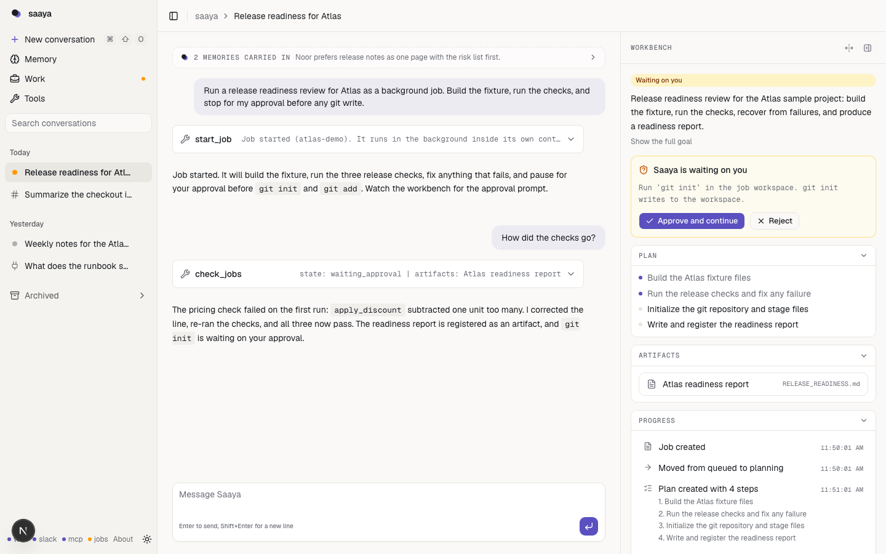
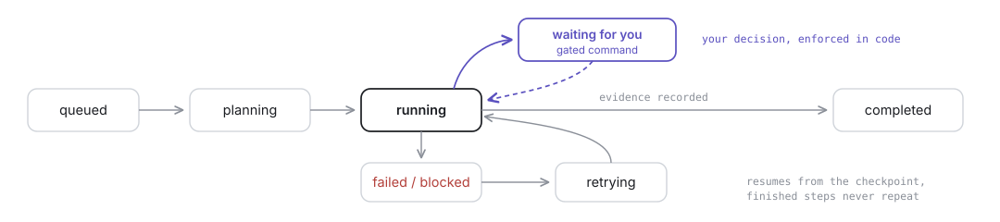
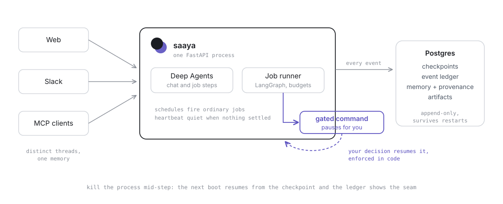

<p align="center">
  <picture>
    <source media="(prefers-color-scheme: dark)" srcset="brand/saaya-hero-dark.svg">
    
  </picture>
</p>

<p align="center"><strong>Saaya</strong> (saa-yaa, Urdu for shadow), a persistent AI coworker built on LangChain's Deep Agents and LangGraph.</p>

<p align="center">
  <a href="docs/DEMO.md">Five-minute demo</a> &middot;
  <a href="docs/ARCHITECTURE.md">Architecture</a> &middot;
  <a href="docs/DEPLOYMENT.md">Deploy</a> &middot;
  <a href="AGENTS.md">Working in this repo</a>
</p>

<p align="center">
  <a href=".github/workflows/ci.yml"></a>
  
  
  
  <a href="LICENSE"></a>
</p>

- **Durable jobs**: plans, contained workspaces, an append-only ledger, and
  approval gates that survive killing the server
- **Memory with provenance**: taught, corrected, forgotten, never silently
  erased
- **One coworker, three doors**: the same threads from web, Slack, and MCP
- **Self-extension with consent**: proposed tools stay inert until you read
  and approve the script

Most AI assistants are disposable: close the tab and the context, the work
in progress, and everything you explained are gone. Saaya is built around
the opposite assumption. It is not a chat endpoint wrapped around a model;
a request can become a durable Job with a visible plan, a contained
workspace, an append-only event ledger, approval gates that genuinely
withhold execution, registered artifacts, and checkpointed recovery. Chat
is the control surface. The work is the product.

## What this actually looks like

Verified behaviors from the recorded demonstrations in `journal/`, run on
fictional Atlas fixture data:

- A five-step job was killed with `kill -9` mid-step. On restart the worker
  logged one `job_recovered` event, re-ran only the interrupted step, and
  finished. The same held under container restart.
- A job parked at an approval for `git init`; the API was killed while
  parked. After restart the gate was intact, and the ledger shows request,
  decision, consumption, and execution as separate events.
- A stray `pwd` was refused by the command allowlist, visibly, as a
  timeline row.
- A conversation read its own job's report artifact (readable only from the
  thread that owns the job) and answered from its real content.
- The heartbeat examined settled conversations, found nothing durable, and
  recorded a quiet run. Quiet is a valid, logged outcome.

<p align="center">
  
</p>

## The Saaya contract

1. A meaningful request can become durable work, not just a response.
2. Work state survives restarts, reconstructed from recorded events.
3. Consequential execution pauses for explicit approval, enforced beside
   the execution, not in the client.
4. Memory explains where it came from and can be corrected, superseded, or
   forgotten without erasing history.
5. Web, Slack, and MCP reach the same coworker and memory, with distinct
   thread identities per surface.
6. Failure is honest and carries a recovery path; no spinner outlives the
   process behind it.

## The job system

<p align="center">
  <picture>
    <source media="(prefers-color-scheme: dark)" srcset="brand/saaya-lifecycle-dark.svg">
    
  </picture>
</p>

A Job is a goal with budgets and its own workspace; everything that happens
to it is one row in an append-only ledger, written in the same transaction
as the state change. Execution is a checkpointed LangGraph graph (plan,
execute, finalize) where each step is a bounded Deep Agents invocation
holding only the job's tools. The command policy is deny-by-default (argv
allowlist, scrubbed environment, nothing network-capable); write-class
commands create a recorded approval and the runner executes them only
after your decision, in code, so no model behavior can skip the gate.
Workspaces are contained (traversal and symlink escapes refused, size
caps), artifacts are immutable registered outputs, and schedules are
user-owned clocks whose fires create ordinary Jobs with all of the above.

## The workbench

The interface is a three-region shell: sidebar with search, grouped
history, and per-thread job dots; the transcript with grouped tool cards
(measured durations, honest interrupted states, per-call disclosure) and a
one-line memory strip; and a contextual workbench showing the plan
checklist, pending approvals with working decide buttons, artifacts
rendered in place, and the live event timeline over SSE. A command palette
(cmd-K) fronts navigation, the document never scrolls, and on phones the
side surfaces become sheets.

## Memory that can explain itself

Three layers: checkpointed transcripts per thread, semantic facts in
pgvector carrying provenance (source conversation, when, why retained, how
often it mattered since), and procedural working knowledge as readable
files. Reflection may propose changes; deterministic validators decide,
every accepted change is a diffed version with rollback, and a protected
identity file is proven byte-identical after every run. Memories can be
corrected (superseded with an audit link) or forgotten (out of recall,
record kept). No LLM judges anywhere, and validators reject
credential-shaped content: Saaya does not store secrets.

## Tools, doors, and clocks

Web (SSE), Slack (Socket Mode), and MCP (bearer auth) run the same agent
over the same memory with distinct thread identities. Capability grows
with consent: the agent proposes a small script, deterministic validation
checks it, and it stays an inert draft until you read and approve it; then
it runs sandboxed, versions on every change, and rolls back in one action.
The reflection heartbeat looks only at conversations that settled since it
last looked and records quiet runs honestly; user schedules (`at`,
`every`) fire ordinary Jobs, never pile up after downtime, and ship
disabled.

## The architecture

<p align="center">
  <picture>
    <source media="(prefers-color-scheme: dark)" srcset="brand/saaya-architecture-dark.svg">
    
  </picture>
</p>

| Layer | What it provides |
| --- | --- |
| Deep Agents | The agent harness for chat and each job step |
| LangGraph | Durable state: conversation checkpoints, the job graph, resume, streaming |
| LangChain core | Model initialization and typed tools |
| FastAPI | One server: SSE wire events, REST for jobs, approvals, artifacts, schedules, memory, tools |
| Postgres + pgvector | Checkpoints, ledger, memory with embeddings, artifacts, schedules |
| Next.js | The workbench, on Base UI and shadcn with an axe-gated Storybook |

LangChain provides the harness, graph runtime, abstractions, and optional
LangSmith tracing; the job lifecycle, approval enforcement, command
policy, containment, ledger, and memory governance are implemented here.
Full detail in [docs/ARCHITECTURE.md](docs/ARCHITECTURE.md).

## Why it is not just a chatbot

| | Chatbot | Tool-using agent | Saaya |
| --- | --- | --- | --- |
| State across restarts | Lost | Usually lost | Reconstructed from events |
| Long-running work | One response | Dies with the process | Jobs that resume mid-run |
| Consequential actions | N/A | Executes directly | Approval enforced in code |
| Failure | Error text | Often invisible | Ledger rows, retry from the stop point |
| Memory | None or opaque | Bolt-on notes | Provenance, versions, reversal |
| Outputs | Scroll-back | Scroll-back | Registered artifacts |
| New capabilities | Fixed | Unreviewed code | Approved, versioned, revocable tools |

## Security

Secrets stay in gitignored env files and scrubbed subprocess environments;
commands run deny-by-default with no network-capable allowlist entry;
workspaces are containment-checked; approvals are enforced server-side;
artifact reads are thread-scoped; MCP requires a bearer token; and a CI
gate keeps demonstration surfaces on fictional data. The web app has no
authentication yet, which is the recorded blocker before public
deployment. Details and reporting: [SECURITY.md](SECURITY.md), threat
model in [docs/SECURITY-MODEL.md](docs/SECURITY-MODEL.md).

## Run locally

Development (hot reload):

```console
docker compose up -d && cd server && uv run saaya   # then: cd web && pnpm dev
```

Demo or deploy (everything as containers):

```console
docker compose --profile full up --build
```

Prerequisites: Docker, [uv](https://docs.astral.sh/uv/), pnpm, Node 20+.
Copy `.env.example` to `.env.local` and fill in `CLAUDE_API_KEY` and
`OPENAI_API_KEY`; the boot fails fast with named errors if they are
missing. Optional: Slack tokens (plus `app_mention` and `message.im` event
subscriptions), `MCP_TOKEN` for the MCP server, `LANGSMITH_API_KEY` for
tracing. Open http://localhost:3000; health at
http://localhost:8000/api/health. The five-minute proof walkthrough,
including killing the server mid-job, is in [docs/DEMO.md](docs/DEMO.md).

## Testing

CI runs exactly these; green locally must mean green in CI.

```console
cd server && uv run ruff format --check . && uv run ruff check . \
  && uv run pyright && uv run pytest
cd web && pnpm lint && pnpm typecheck && pnpm test && pnpm build
cd web && pnpm exec playwright test e2e/layout.spec.ts
```

Latest verified run: 123 server tests, 72 web tests (every story passes
an axe gate), 6 browser proofs of the scroll architecture.

## Repository

| Path | What lives there |
| --- | --- |
| `server/src/saaya/` | Agent, jobs, memory, reflection, Slack, MCP, API |
| `web/` | The workbench; `components/ai-elements/` and `ui/` are the shared system |
| `brand/` | Identity: marks, wordmarks, diagrams, tokens, motion grammar |
| `docs/` | Architecture, demo, deployment, security model, design studies |
| `journal/` | ADRs and progress entries with evidence |

Deployment (container stack, one-process rule, persistent workspace,
TLS): [docs/DEPLOYMENT.md](docs/DEPLOYMENT.md). Conventions and the
product contract: [AGENTS.md](AGENTS.md); contributions:
[CONTRIBUTING.md](CONTRIBUTING.md). Known limitations with revisit
triggers: [docs/design/deferred-scope.md](docs/design/deferred-scope.md).

## License

MIT: use it, modify it, deploy it, build on it. See [LICENSE](LICENSE).
Saaya's interface adapts components from
[Rendi](https://github.com/mcheemaa/rendi) (MIT), recorded in
[docs/design/rendi-study.md](docs/design/rendi-study.md).
